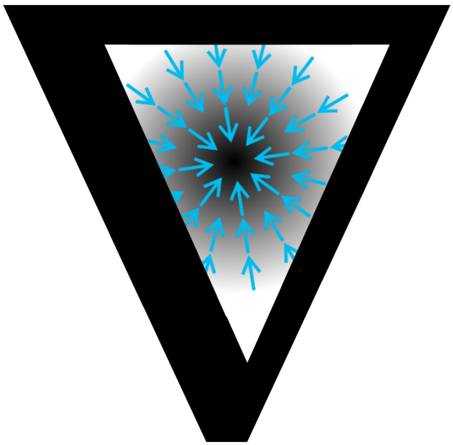

# microgra∇uate

[](./)

A self-contained course to learn the basics of neural networks.

## Run online

| Notebook | Colab Link |
|----------|-------------|
| [micrograd](./micrograd.ipynb) | [](https://colab.research.google.com/github/ckarageorgkaneen/micrograduate/blob/main/micrograd.ipynb) |
| [makemore1](./makemore1.ipynb) | [](https://colab.research.google.com/github/ckarageorgkaneen/micrograduate/blob/main/makemore1.ipynb) |
| [makemore2](./makemore2.ipynb) | [](https://colab.research.google.com/github/ckarageorgkaneen/micrograduate/blob/main/makemore2.ipynb) |
| [makemore3](./makemore3.ipynb) | [](https://colab.research.google.com/github/ckarageorgkaneen/micrograduate/blob/main/makemore3.ipynb) |
| [makemore4](./makemore4.ipynb) | [](https://colab.research.google.com/github/ckarageorgkaneen/micrograduate/blob/main/makemore4.ipynb) |
| [makemore5](./makemore5.ipynb) | [](https://colab.research.google.com/github/ckarageorgkaneen/micrograduate/blob/main/makemore5.ipynb) |

## Run locally

1. Clone [micrograduate](https://github.com/ckarageorgkaneen/micrograduate.git) repository:
```bash
git clone https://github.com/ckarageorgkaneen/micrograduate.git
```
2. Install package virtual environment:
```bash
pip install -e .
```
3. Run notebooks in [Notebook Server](https://docs.jupyter.org/en/latest/running.html), [VSCode/Cursor](https://code.visualstudio.com/docs/datascience/jupyter-notebooks), etc.

## Acknowledgements

Many thanks to [Andrej Karpathy](https://github.com/karpathy):
- [Neural Networks: Zero to Hero](https://github.com/karpathy/nn-zero-to-hero)
- [Eureka Labs](https://eurekalabs.ai/)

[](https://opensource.org/licenses/MIT)
